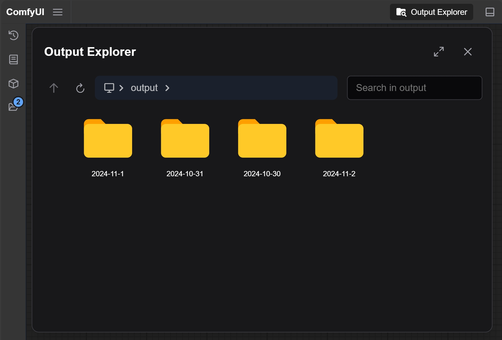

# ComfyUI Image Browsing

Browsing Output Images in ComfyUI

## Installation

There are three installation methods, choose one

1. Clone the repository: `git clone https://github.com/hayden-fr/ComfyUI-Image-Browsing.git` to your ComfyUI `custom_nodes` folder
2. Download the [latest release](https://github.com/hayden-fr/ComfyUI-Image-Browsing/releases/latest/download/dist.tar.gz) and extract it to your ComfyUI `custom_nodes` folder
3. Use comfy cli: `comfy node registry-install comfyui-image-browsing`
